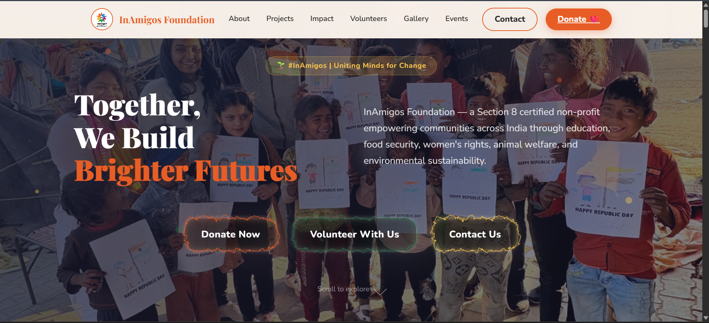
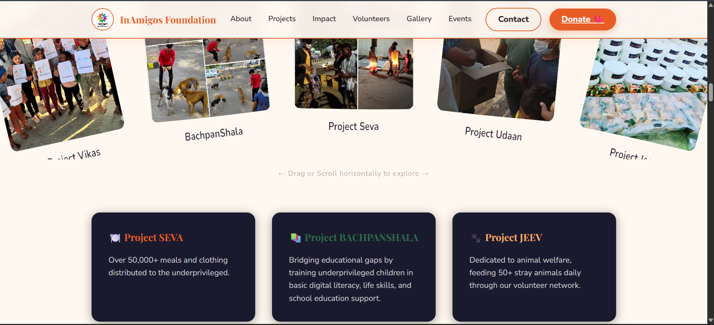
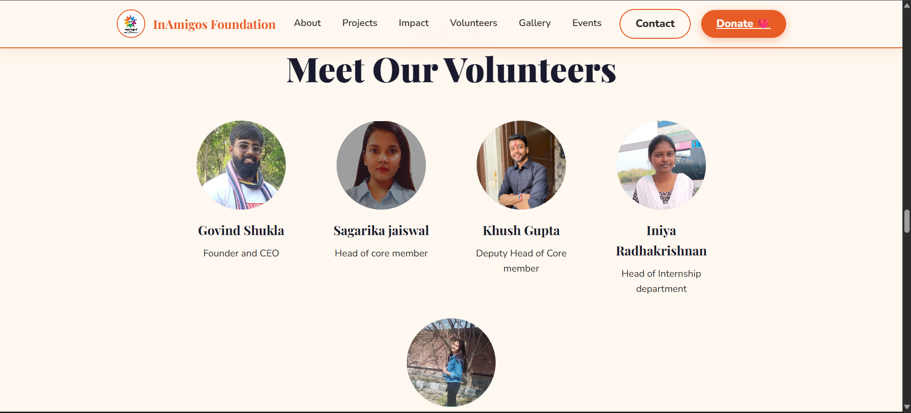

# 🌟 InAmigos Foundation — Awareness Website

A modern, highly interactive, and visually rich awareness webpage designed for **InAmigos Foundation** — a Section 8 non-profit organization registered in Chhattisgarh, India.

> **🔗 Live Developed Site:** [**https://in-amigos-foundation-five.vercel.app**](https://in-amigos-foundation-five.vercel.app/#hero)

## 📸 Screenshots

---

## 🏛️ About the Foundation
**InAmigos Foundation** is committed to creating lasting social impact across India. Based in Chhattisgarh and operating through a strong network of dedicated professionals and volunteers spanning 28 states, the foundation champions 6 core pillars of change:
- **Project Seva:** Humanitarian relief and food distribution.
- **BachpanShala:** Education for underprivileged children.
- **Project Jeev:** Animal welfare.
- **Project Udaan:** Women empowerment.
- **Project Prakriti:** Environmental conservation.
- **Project Vikas:** Skill development and internships.

The operations are backed by 80G & 12A certifications, NITI Aayog registration, and the prestigious IAF ISO 9001:2015 certification.

---

## 🎨 Design System & Aesthetics
The design adopts the **"Warm Earth + Vibrant Humanity"** theme, blending warm tones of compassion with forest/sustainability greens and deep, trustable navy blues.

- **Primary Color:** `#E85D26` (Burnt Orange — representing energy & compassion)
- **Secondary Color:** `#2C6E49` (Forest Green — representing nature, environmental initiatives)
- **Accent Color:** `#F9C74F` (Sunflower Yellow — representing hope & warmth)
- **Dark Base:** `#1A1A2E` (Deep Navy — for high-contrast headers, dark banners, and readability)
- **Light BG:** `#FFF8F0` (Warm Cream — for softness and editorial reading appeal)
- **Typography:**
  - **Headings:** `Playfair Display` (serif) — editorial and dignified.
  - **Body / Interface:** `Nunito` (sans-serif) — friendly, soft-rounded, and clean.

---

## 🏗️ Website Structure (Core Sections)
1. **Sticky Navigation Bar:** Real-time scroll transition, centered links, dark-themed hover effects with a specialized interactive "Dock" style magnification.
2. **Hero Banner:** Full-screen immersive introduction with animated floating particles, dual call-to-actions, and scroll cues.
3. **About Section:** Detailed profile featuring a deep dynamic light ray background highlighting the foundation's origins and legal certifications.
4. **Stats Counter Strip:** Animated number counters that trigger sequentially when scrolled into view.
5. **Our Initiatives:** A combination of a circular 3D interactive gallery and beautiful dark cards detailing the 6 pillars of change.
6. **Social Impact:** Alternating side-by-side grids highlighting specific case studies with impact bullet points.
7. **Volunteers Section:** A dedicated showcase of the core members driving the foundation forward.
8. **Visual Gallery:** A masonry-style photo grid featuring volunteer and project actions with caption overlay hovers.
9. **Events Timeline:** A vertical milestones roadmap highlighting recent awareness days.
10. **Testimonials / Volunteer Voices:** Testimonial blocks with backdrop blur filters capturing volunteer feedback.
11. **Call-to-Action Panel:** A prominent multi-card section promoting donating, volunteering, or partnering with official social handles.
12. **Dignified Footer:** Complete with quick links, contact info, and copyright text.

---

## 🛠️ Installation & Setup
Since the website is built on vanilla web technologies, there are zero build processes or heavy node modules to install. 

1. **Locate files:**
   - `index.html`
   - `style.css`
2. **Launch:**
   - Simply double-click `index.html` to open it in your browser.
   - Alternatively, serve it using a lightweight local development server (like VS Code Live Server or Python's `http.server`).

---

*Developed for the InAmigos Foundation Intern Campaign | #InAmigos*
